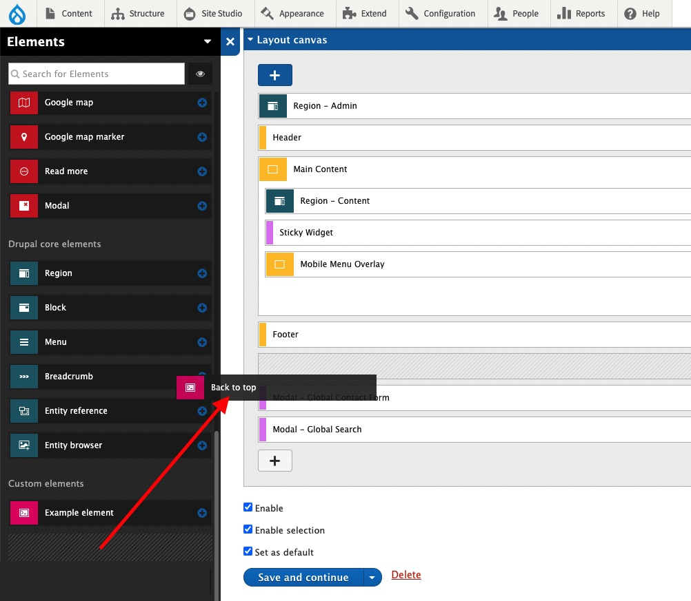
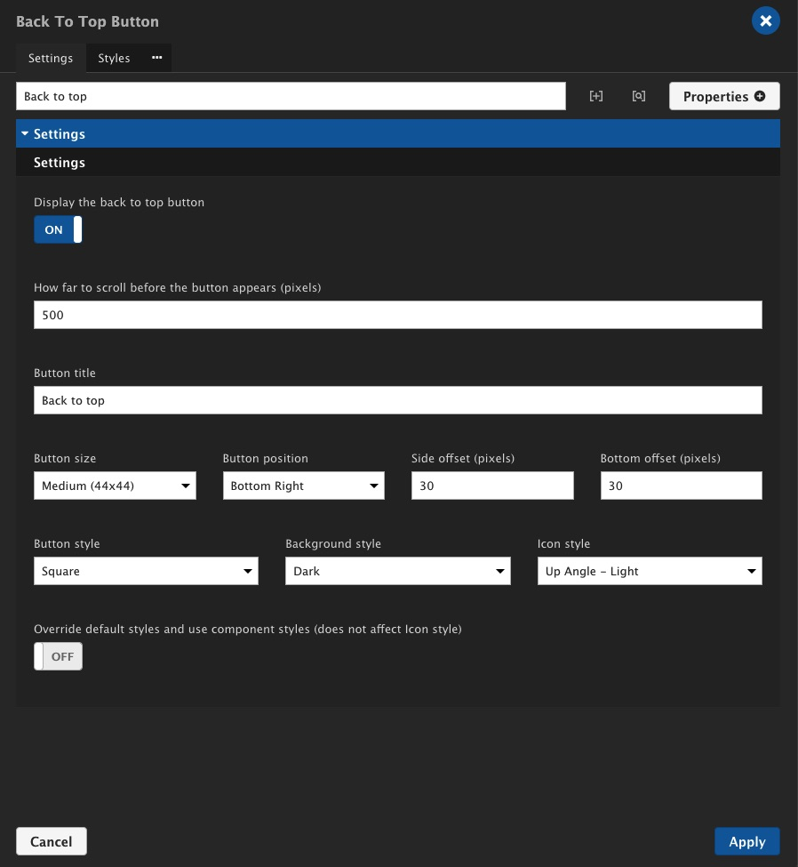
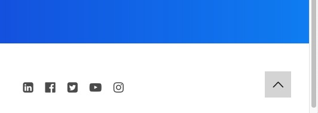

# Site Studio Back To Top Button

This back to top button works exclusively with [Acquia Site Studio](https://www.acquia.com/products/drupal-cloud/site-studio). It is installed as a [Drupal module](https://www.drupal.org/project/project_module) and once activated, will appear under the [custom elements](https://sitestudiodocs.acquia.com/6.5/user-guide/how-create-custom-element) section within the [Sidebar browser](https://sitestudiodocs.acquia.com/6.5/user-guide/creating-content-components).

&nbsp;

***

&nbsp;

### Requirements

&nbsp;

- Drupal 8+ or 9+
- Acquia Site Studio
- Working knowledge of Acquia Site Studio

&nbsp;

***

&nbsp;

### How To Use

&nbsp;

#### Installation

Installation coming soon ...

&nbsp;

#### Configuration

The components panel has a few settings available for the default configuration of the button. There is also an option to turn off the default settings, and completely restyle the button through the component panel styles tab. The only setting that cannot be restyled is the choice of an icon, however if you are well versed in CSS, the default icon can be hidden and a custom icon image or Site Studio webfont icon can be used.

&nbsp;

- Show or hide the button on the page or inside a Site Studio component
- How far to scroll down the page in pixels until the button animates visibility
- Change the text for the button's title attribute
- Pick a button size (Small 32x32, Medium 44x44, Large 56x56)
- Change the button position (Bottom Left, Bottom Right)
- How far the button is from the side of the page in pixels
- How for the button is from the bottom of the page in pixels
- Choose from a square or circlular button style
- Choose a button background style (Light or Dark)
- Choose an icon style (Angle or Arrow)
- Override the default styles and use the component styles tab

&nbsp;

***

&nbsp;

### Screen Shots

&nbsp;

*Dragging component from the custom elements section*

&nbsp;

*Component options panel*

&nbsp;

*Back to top button displayed on a page*

&nbsp;

***

&nbsp;

### To Do

&nbsp;

- Publish to [Drupal modules](https://www.drupal.org/project/project_module) website

&nbsp;

&nbsp;

